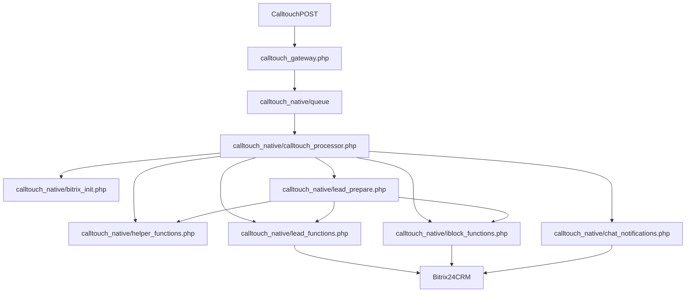

# FILE_DEPENDENCY_MAP

Короткая карта зависимостей и точек входа для проекта `calltouch`.

## Главный runtime-путь

## Основные точки входа

`calltouch_gateway.php`

- принимает `POST` от `Calltouch`;
- пишет JSON в `calltouch_native/queue`;
- запускает `calltouch_native/calltouch_processor.php`.

`calltouch_native/calltouch_processor.php`

- главный orchestrator;
- обрабатывает очередь;
- создает или обновляет лид;
- перемещает ошибочные файлы в `queue_errors`.

`calltouch_native/queue_manager.php`

- ручное управление очередью и ошибками;
- запускает обработку, retry, удаление, просмотр файлов.

`calltouch_native/config_manager.php`

- редактирует `calltouch_native/calltouch_config.php`.

`calltouch_native/requeue_and_process.php`

- возвращает файл из `queue_errors` в `queue`;
- снова запускает процессор.

`calltouch_native/add_iblock54.php`

- вручную добавляет отсутствующий элемент в список `54`.

## Кто кого подключает

`calltouch_native/calltouch_processor.php`

- подключает `bitrix_init.php`
- подключает `helper_functions.php`
- подключает `iblock_functions.php`
- подключает `lead_functions.php`
- подключает `lead_prepare.php`
- подключает `chat_notifications.php`

`calltouch_native/lead_prepare.php`

- подключает `bitrix_init.php`
- подключает `iblock_functions.php`
- подключает `helper_functions.php`
- подключает `lead_functions.php`

`calltouch_native/lead_functions.php`

- подключает `bitrix_init.php`
- подключает `helper_functions.php`

`calltouch_native/iblock_functions.php`

- подключает `bitrix_init.php`

`calltouch_native/chat_notifications.php`

- подключает `bitrix_init.php`

`calltouch_native/config_manager.php`

- использует `calltouch_config.php`
- при необходимости подключает `bitrix_init.php`
- подключает `chat_notifications.php`

`calltouch_native/queue_manager.php`

- использует `calltouch_config.php`
- при необходимости подключает `bitrix_init.php`
- подключает `chat_notifications.php`

## Где менять что

Если нужно изменить прием входящего payload:

- иди в `calltouch_gateway.php`

Если нужно изменить выбор файла из очереди, основной цикл обработки, routing в errors:

- иди в `calltouch_native/calltouch_processor.php`

Если нужно изменить нормализацию телефона, работу с логами, cleanup ошибок, `ctCallerId` index:

- иди в `calltouch_native/helper_functions.php`

Если нужно изменить маппинг payload -> поля лида:

- иди в `calltouch_native/lead_prepare.php`

Если нужно изменить создание, обновление, дедупликацию или наблюдателей:

- иди в `calltouch_native/lead_functions.php`

Если нужно изменить поиск по спискам `54`, `19`, `22`:

- иди в `calltouch_native/iblock_functions.php`

Если нужно изменить bootstrap `Bitrix`, CLI/HTTP окружение, обход auth:

- иди в `calltouch_native/bitrix_init.php`

Если нужно изменить уведомления в чат:

- иди в `calltouch_native/chat_notifications.php`

Если нужно изменить retry через браузер:

- иди в `calltouch_native/requeue_and_process.php`

Если нужно изменить ручное создание элемента в списке `54`:

- иди в `calltouch_native/add_iblock54.php`

Если нужно изменить UI управления очередью:

- иди в `calltouch_native/queue_manager.php`

Если нужно изменить UI конфигурации:

- иди в `calltouch_native/config_manager.php`

## Критичные зависимости

Самая важная цепочка:

- `calltouch_gateway.php`
- `calltouch_native/calltouch_processor.php`
- `calltouch_native/lead_prepare.php`
- `calltouch_native/iblock_functions.php`
- `calltouch_native/lead_functions.php`
- `calltouch_native/calltouch_config.php`

Изменение любого из этих файлов может повлиять на продовую обработку звонков.

## Внешние зависимости Bitrix

Код критично зависит от:

- CRM API: `CCrmLead`, `CCrmFieldMulti`
- IBlock API: `CIBlockElement`
- Chat API: `CIMMessenger`
- модулей: `crm`, `iblock`, `im`, `lists`
- структуры списков `54`, `19`, `22`
- свойств `PROPERTY_*`
- пользовательских полей `UF_CRM_*`

## Важное замечание

Основной рабочий контур находится в `calltouch_native/*`.

Файлы в корне проекта с теми же именами:

- `calltouch_processor.php`
- `requeue_and_process.php`
- `add_iblock54.php`
- `chat_notifications.php`

нужно считать потенциальными legacy-дублями, пока не доказано обратное. При изменениях сначала проверяй, что работаешь именно с активной версией файла.
