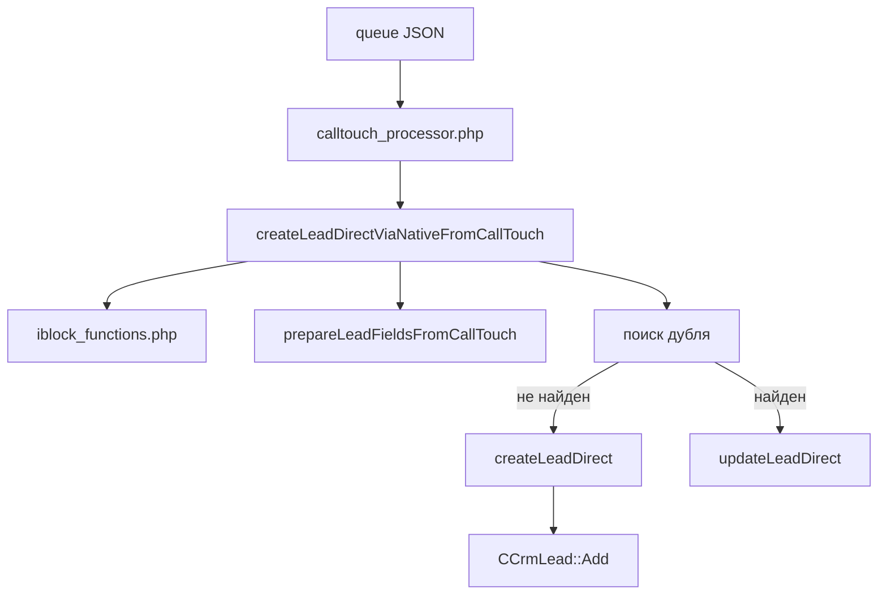

# LEAD_CREATION

Отдельное описание того, как в проекте создается лид в `Bitrix24`.

## Где находится логика

Основная цепочка создания лида проходит через файлы:

- `calltouch_native/calltouch_processor.php`
- `calltouch_native/lead_prepare.php`
- `calltouch_native/lead_functions.php`
- `calltouch_native/iblock_functions.php`
- `calltouch_native/helper_functions.php`
- `calltouch_native/bitrix_init.php`

## Коротко по цепочке

## 1. Откуда берутся данные для создания

Новый лид создается не напрямую из `Calltouch`, а после прохождения нескольких этапов:

1. `calltouch_gateway.php` принимает `POST`.
2. Payload сохраняется в `calltouch_native/queue/*.json`.
3. `calltouch_native/calltouch_processor.php` читает этот файл.
4. Данные валидируются и нормализуются.
5. Затем вызывается `createLeadDirectViaNativeFromCallTouch($data, $config)`.

## 2. Что проверяется до создания лида

До фактического `CCrmLead::Add()` система проверяет:

- JSON должен корректно декодироваться;
- должен быть телефон (`callerphone` или `phonenumber`);
- `callphase` должен быть разрешен в `allowed_callphases`, если событие не `request`;
- должен определиться `nameKey` источника;
- должен быть `siteId`;
- в списке `54` должна существовать пара `NAME + PROPERTY_199(siteId)`.

Если одна из этих проверок не проходит:

- лид не создается;
- файл уходит в `queue_errors`;
- может уйти уведомление в чат.

## 3. Как определяется источник лида

Перед созданием лида система пытается понять, к какому источнику относится звонок.

Для этого в `createLeadDirectViaNativeFromCallTouch()` собирается `nameKey` в таком порядке:

1. `hostname`
2. `url`
3. `callUrl`
4. `siteName`
5. `subPoolName`

После этого выполняется поиск элемента в списке `54` по точной паре:

- `NAME = nameKey`
- `PROPERTY_199 = siteId`

Если точного совпадения нет, дополнительно пробуется `subPoolName`.

Без найденного элемента в списке `54` создание лида не продолжается.

## 4. Как формируются поля лида

Формирование полей происходит в `prepareLeadFieldsFromCallTouch($data, $elementData, $config)`.

### Базовые поля

Заполняются:

- `TITLE`
- `NAME`
- `LAST_NAME`
- `COMMENTS`
- `SOURCE_DESCRIPTION`

Если имя не пришло:

- `NAME = Имя`
- `LAST_NAME = Фамилия`

### Телефон

Телефон берется из:

- `callerphone`
- или `phone`

Потом нормализуется в формат:

- `+7XXXXXXXXXX`

Если корректно нормализовать номер не удалось:

- поле телефона не заполняется;
- но сам лид теоретически может все равно быть создан, если до этого файл не был отброшен на этапе валидации процессора.

### Данные из списков Bitrix

Из списка `54` и связанных списков подтягиваются:

- `SOURCE_ID` через `PROPERTY_192 -> список 19 -> PROPERTY_73`
- `ASSIGNED_BY_ID` через `PROPERTY_191 -> список 22 -> PROPERTY_185`
- `UF_CRM_1744362815` из `PROPERTY_191`
- `UF_CRM_1745957138` из `PROPERTY_193`
- `UF_CRM_1754927102` из `PROPERTY_194`
- `OBSERVER_IDS` из `PROPERTY_195`

### UTM-поля

Если в payload есть `utm_*`, они маппятся в:

- `UTM_SOURCE`
- `UTM_MEDIUM`
- `UTM_CAMPAIGN`
- `UTM_CONTENT`
- `UTM_TERM`

## 5. Когда новый лид не создается

Новый лид не создается в трех основных случаях.

### 1. `ctCallerId` уже известен

Если:

- включен `ctCallerId.enabled`;
- в payload есть `ctCallerId`;
- этот `ctCallerId` уже есть в `ctcallerid_index.json`;

то обработка пропускается, и система считает, что лид уже существует.

Итог:

- `CCrmLead::Add()` не вызывается.

### 2. Найден дубль по дедупликации

Если:

- включена `deduplication.enabled`;
- есть нормализованный телефон;
- найден существующий лид по телефону и ключевым словам заголовка;

то вызывается `updateLeadDirect()`, а не создание нового лида.

Итог:

- вместо нового лида обновляется существующий.

### 3. Создание невозможно из-за ошибок

Например:

- не найден элемент в списке `54`;
- не прошли ранние проверки;
- `CCrmLead::Add()` вернул ошибку.

Итог:

- файл уходит в `queue_errors`.

## 6. В какой момент начинается именно создание нового лида

Новый лид создается только если одновременно выполнено все ниже:

- файл успешно дошел до `createLeadDirectViaNativeFromCallTouch()`;
- найден корректный элемент в списке `54`;
- сформирован набор полей лида;
- `ctCallerId` не дал `SKIPPED`;
- дедупликация либо выключена, либо не нашла существующий лид, либо обновление дубля не удалось.

Только после этого вызывается:

- `createLeadDirect($leadFields, $config)`

## 7. Как работает `createLeadDirect()`

Файл:

- `calltouch_native/lead_functions.php`

Функция:

- подключает модуль `crm`;
- создает экземпляр `CCrmLead(false)`;
- собирает `$arFields`;
- вызывает `CCrmLead::Add($arFields, true, ['REGISTER_SONET_EVENT' => 'Y'])`.

### Какие поля реально отправляются в `CCrmLead::Add`

Из подготовленных полей в `$arFields` попадают:

- `TITLE`
- `NAME`
- `LAST_NAME`
- `STATUS_ID`
- `SOURCE_ID`
- `SOURCE_DESCRIPTION`
- `ASSIGNED_BY_ID`
- `COMMENTS`
- все `UF_CRM_*`
- `UTM_*`
- `FM['PHONE']`

Если `STATUS_ID` не задан явно:

- используется `config['lead']['STATUS_ID']`
- по умолчанию это обычно `NEW`

## 8. Что происходит после успешного создания

Если `CCrmLead::Add()` вернул ID:

1. система логирует успешное создание;
2. дополнительно проверяет, какой телефон реально сохранился в `Bitrix`;
3. если есть `ctCallerId`, записывает его в `ctcallerid_index.json`;
4. если есть `OBSERVER_IDS`, вызывает установку наблюдателей;
5. процессор пишет общий и site-specific лог;
6. исходный JSON удаляется из `queue`.

## 9. Что происходит при ошибке создания

Если `CCrmLead::Add()` не вернул ID:

1. ошибка пишется в лог;
2. `createLeadDirectViaNativeFromCallTouch()` возвращает неуспех;
3. `calltouch_processor.php` считает создание лида проваленным;
4. файл переносится в `calltouch_native/queue_errors`;
5. при включенной настройке уходит уведомление в чат.

## 10. Главные особенности именно создания лида

- Создание нового лида в этом проекте всегда зависит от маппинга через список `54`.
- Лид не создается сразу из payload, а только после обогащения данными из `Bitrix`.
- `ctCallerId` может полностью отменить создание, если звонок уже обрабатывался.
- Дедупликация может заменить создание обновлением существующего лида.
- Телефон передается как мультиполе `FM['PHONE']`.
- Наблюдатели назначаются после создания, а не внутри `CCrmLead::Add()`.

## 11. Самые важные файлы для правок, если нужно менять создание лида

Если нужно изменить правила создания:

- `calltouch_native/lead_prepare.php`

Если нужно изменить набор или формат полей лида:

- `calltouch_native/lead_prepare.php`
- `calltouch_native/helper_functions.php`

Если нужно изменить сам вызов `Bitrix` API:

- `calltouch_native/lead_functions.php`

Если нужно изменить зависимость от списка `54`, `19`, `22`:

- `calltouch_native/iblock_functions.php`

Если нужно изменить ранние условия допуска файла до создания:

- `calltouch_native/calltouch_processor.php`

## 12. Что чаще всего ломает создание лида

- нет пары `NAME + siteId` в списке `54`
- телефон пришел в неожиданном формате
- `callphase` не входит в `allowed_callphases`
- дедупликация неожиданно находит дубль и создание не происходит
- `ctCallerId` уже есть в индексе
- ошибка в схеме списков `Bitrix` или `UF_CRM_*`
- проблема в bootstrap `Bitrix` через `bitrix_init.php`
