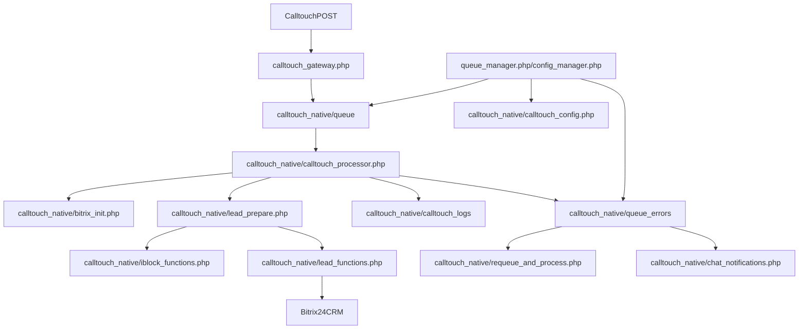

# PROJECT_OVERVIEW

## 1. Назначение проекта

Проект `calltouch` реализует интеграцию между `Calltouch` и `Bitrix24` в формате локального PHP-обработчика.

Основная задача системы:

- принять входящий payload от `Calltouch`;
- быстро сохранить его в файловую очередь;
- асинхронно обработать данные;
- найти или создать лид в `Bitrix24` через нативный API;
- при ошибке перенести payload в папку ошибок и при необходимости уведомить ответственных в чате `Bitrix24`.

По фактическому коду активный рабочий контур проходит через `calltouch_gateway.php` и директорию `calltouch_native/`.

## 2. Общая архитектура

Архитектура построена вокруг файловой очереди и нативных модулей `Bitrix24`.

Упрощенная схема:

Ключевые особенности архитектуры:

- входной HTTP endpoint не делает тяжелую бизнес-логику, а только сохраняет JSON в очередь;
- основной процессинг выполняется отдельным PHP-скриптом в фоне;
- вся интеграция с `Bitrix24` идет не через REST, а через внутренние PHP API и модули `Bitrix`;
- данные для лида обогащаются через списки и инфоблоки `Bitrix`;
- операционное управление вынесено в отдельные веб-интерфейсы;
- ошибки обработки не теряются: они маршрутизируются в `queue_errors` и могут быть обработаны вручную.

## 3. Точки входа

### Основная входная точка приема событий

`calltouch_gateway.php`

Что делает:

- принимает `$_POST` от `Calltouch`;
- сохраняет payload в `calltouch_native/queue/ct_*.json`;
- сразу возвращает `200 OK`;
- запускает `calltouch_native/calltouch_processor.php` в фоне через CLI;
- если путь к скрипту не найден, пробует HTTP fallback с `internal_key`.

Это основной intake-слой системы.

### Основной процессор

`calltouch_native/calltouch_processor.php`

Поддерживает несколько режимов запуска:

- CLI без аргументов: обработать всю очередь;
- CLI с аргументом: обработать один файл;
- HTTP `?run=all`: обработать все файлы;
- HTTP `?mode=file&filepath=...`: обработать конкретный файл.

### Операционные и административные точки входа

`calltouch_native/queue_manager.php`

- веб-панель для просмотра и управления `queue` и `queue_errors`;
- умеет запускать процессор, открывать содержимое файлов, удалять файлы, возвращать ошибки обратно в очередь.

`calltouch_native/config_manager.php`

- веб-форма редактирования `calltouch_config.php`;
- умеет сохранять backup конфига;
- управляет параметрами лидов, фильтрацией событий, дедупликацией, `ctCallerId`, логами, инфоблоками и уведомлениями.

`calltouch_native/requeue_and_process.php`

- служебный endpoint для возврата файла из `queue_errors` обратно в `queue`;
- сразу запускает повторную обработку.

`calltouch_native/add_iblock54.php`

- служебный endpoint для создания отсутствующего элемента в инфоблоке/списке `54` по паре `NAME + PROPERTY_199(siteId)`;
- используется как операционный shortcut из чат-уведомлений об ошибках.

## 4. Ключевые файлы и их роли

### Активный runtime-контур

`calltouch_gateway.php`

- прием payload;
- запись в очередь;
- старт фоновой обработки;
- логирование запуска в `gateway_exec.log`.

`calltouch_native/calltouch_processor.php`

- центральный orchestrator обработки;
- загружает конфиг, Bitrix bootstrap и вспомогательные модули;
- выбирает файлы из очереди;
- валидирует и нормализует данные;
- вызывает создание или обновление лида;
- пишет логи;
- удаляет успешно обработанные файлы;
- отправляет ошибочные файлы в `queue_errors`.

`calltouch_native/bitrix_init.php`

- инициализация окружения `Bitrix24` для CLI и HTTP;
- поиск `DOCUMENT_ROOT` и `prolog_before.php`;
- установка служебных констант `BX_CRONTAB`, `BX_SKIP_POST_UNPACK`, `NOT_CHECK_PERMISSIONS` и других;
- подгрузка модулей `crm`, `iblock`, `im`, `lists`, `bizproc`;
- попытка обхода стандартной авторизации для внутренних запросов и web-интерфейсов.

`calltouch_native/helper_functions.php`

- логирование и ротация логов;
- нормализация телефона;
- вычисление даты по периоду;
- выбор домена-источника;
- нормализация `callUrl` и `url`;
- перемещение файлов в ошибки;
- удаление успешно обработанных файлов;
- очистка старых ошибок;
- работа с JSON-индексом `ctCallerId -> leadId`.

`calltouch_native/lead_prepare.php`

- преобразует payload `Calltouch` в поля лида `Bitrix24`;
- ищет соответствие источника в инфоблоке `54`;
- подтягивает связанные значения из списков `19` и `22`;
- применяет дедупликацию;
- проверяет `ctCallerId`;
- решает, обновлять существующий лид или создавать новый.

`calltouch_native/lead_functions.php`

- создание лида через `CCrmLead`;
- обновление существующего лида;
- поиск дублей по телефону и заголовку;
- явный запуск CRM robots и BizProc после успешного создания;
- установка наблюдателей;
- частично защищает существующие данные от перезаписи.

`calltouch_native/iblock_functions.php`

- поиск элемента в списке `54` по паре `NAME + PROPERTY_199`;
- получение `SOURCE_ID` из списка `19`;
- получение `ASSIGNED_BY_ID` из списка `22`.

`calltouch_native/chat_notifications.php`

- отправка сообщений в чат `Bitrix24` через `CIMMessenger::Add`;
- уведомления об ошибках;
- отправка дневного access key для веб-интерфейсов.

### Операционный слой

`calltouch_native/queue_manager.php`

- управление очередью и ошибками;
- ручной просмотр JSON;
- фоновый запуск обработки;
- удаление и повторная постановка файлов в очередь.

`calltouch_native/config_manager.php`

- управление конфигом через HTML-форму;
- запись PHP-конфига через `var_export`.

`calltouch_native/requeue_and_process.php`

- возврат ошибочного JSON обратно в очередь;
- фоновый старт обработки без полноценной авторизации.

`calltouch_native/add_iblock54.php`

- ручное создание записи в списке `54`, если автоматическая обработка не нашла соответствующий источник.

### Артефакты и данные на диске

`calltouch_native/queue`

- основная файловая очередь входящих payload.

`calltouch_native/queue_errors`

- хранилище ошибок обработки;
- сюда перемещаются файлы с ошибками валидации, маппинга и создания лида.

`calltouch_native/calltouch_logs`

- ранние и рабочие логи;
- включает как общие, так и site-specific журналы.

`calltouch_native/ctcallerid_index.json`

- локальный индекс идемпотентности для повторных событий по `ctCallerId`.

## 5. Поток данных от входящего события до результата

### 1. Прием события

`calltouch_gateway.php` принимает входящий `POST` от `Calltouch`.

Что происходит:

- `$_POST` сериализуется в JSON;
- создается файл `ct_YYYYMMDD_HHMMSS_<uniqid>.json`;
- файл кладется в `calltouch_native/queue`;
- клиенту быстро возвращается `OK`.

### 2. Запуск обработки

После ответа gateway запускает `calltouch_native/calltouch_processor.php` в фоне.

Основной сценарий:

- запуск через CLI `php calltouch_processor.php <filepath>`;
- вывод и диагностическая информация пишутся в `calltouch_logs/gateway_exec.log`.

Fallback-сценарий:

- если файл процессора не найден, вызывается HTTP endpoint процессора с `internal_key`.

### 3. Инициализация окружения

`calltouch_processor.php`:

- читает `calltouch_native/calltouch_config.php`;
- создает ранний лог `processor_start.log`;
- подключает `bitrix_init.php`;
- после инициализации подключает `helper_functions.php`, `iblock_functions.php`, `lead_functions.php`, `lead_prepare.php`, `chat_notifications.php`.

### 4. Выбор файлов из очереди

Процессор поддерживает:

- обработку конкретного файла;
- обработку всей очереди;
- запуск из браузера;
- запуск из CLI.

Если файлов нет, это фиксируется в общем логе, после чего процессор завершает работу.

### 5. Базовая валидация и нормализация

Для каждого JSON-файла:

- выполняется `json_decode`;
- если JSON невалиден, файл уходит в `queue_errors` как `invalid_json`;
- вызывается `fixCallUrlAndUrl()` для заполнения `callUrl/url` из `subPoolName`;
- проверяется наличие телефона;
- выполняется нормализация телефона в формат `+7XXXXXXXXXX`;
- для не-`request` событий проверяется, входит ли `callphase` в `allowed_callphases`.

Если фаза не разрешена, файл:

- логируется как пропущенный;
- переносится в `queue_errors` с причиной `wrong_phase`.

### 6. Поиск источника и подготовка лида

`createLeadDirectViaNativeFromCallTouch()`:

- выбирает `nameKey` из `hostname`, `url`, `callUrl`, `siteName` или `subPoolName`;
- берет `siteId`;
- ищет элемент в списке `54` по паре `NAME + PROPERTY_199(siteId)`;
- если запись не найдена, возвращает ошибку `name_property199_pair_not_found`.

Если элемент найден:

- `prepareLeadFieldsFromCallTouch()` формирует поля лида;
- телефон пишется как мультиполе `PHONE`;
- из списка `19` тянется `SOURCE_ID`;
- из списка `22` тянется `ASSIGNED_BY_ID`;
- пользовательские поля CRM заполняются из свойств списка `54`;
- добавляются `UTM_*`, `COMMENTS`, `SOURCE_DESCRIPTION`;
- из `PROPERTY_195` формируется `OBSERVER_IDS`.

### 7. Проверка `ctCallerId`

Если в конфиге включен `ctCallerId` и в payload пришел `ctCallerId`:

- загружается `ctcallerid_index.json`;
- индекс чистится по retention;
- если `ctCallerId` уже известен и привязан к лиду, обработка пропускается и считается успешной.

Это механизм идемпотентности для повторных событий звонка.

### 8. Дедупликация

Если в конфиге включена дедупликация:

- телефон снова нормализуется;
- по ключевым словам из `deduplication.title_keywords` выполняется поиск существующего лида;
- если найден дубликат, вызывается `updateLeadDirect()`;
- если обновление успешно, при необходимости обновляется индекс `ctCallerId` и выставляются наблюдатели.

Если дубликат не найден или обновление не удалось:

- создается новый лид.

### 9. Создание лида

`createLeadDirect()`:

- работает через `CCrmLead`;
- формирует массив полей для `Add`;
- передает `CURRENT_USER`, который берется из `ASSIGNED_BY_ID`, рассчитанного через список `22`;
- передает `FM['PHONE']` для множественных телефонов;
- записывает UTM-поля;
- проверяет, что лид реально создан;
- после успешного `Add` явно запускает CRM robots и BizProc;
- дополнительно логирует телефоны, которые фактически сохранились в CRM.

### 10. Завершение обработки файла

При успехе:

- пишутся общий и site-specific логи;
- файл удаляется из `queue`;
- при наличии `ctCallerId` создается или обновляется запись в `ctcallerid_index.json`.

При ошибке:

- файл перемещается в `queue_errors`;
- причина отражается в имени error-файла;
- при включенной опции отправляется уведомление в чат.

## 6. Работа с лидами Bitrix24

### Используемый API

Система использует нативный PHP API `Bitrix24`, а не REST.

Основные классы:

- `CCrmLead`
- `CCrmFieldMulti`
- `CIBlockElement`
- `CIMMessenger`
- `CCrmBizProcHelper`
- `\Bitrix\Crm\Automation\Starter`

Это значит, что система сильно зависит от структуры и поведения локального `Bitrix`-окружения.

### Создание лидов

Создание идет через `createLeadDirect()`.

Основные поля:

- `TITLE`
- `NAME`
- `LAST_NAME`
- `STATUS_ID`
- `SOURCE_ID`
- `SOURCE_DESCRIPTION`
- `ASSIGNED_BY_ID`
- `COMMENTS`
- `UTM_*`
- `UF_CRM_*`
- мультиполя `FM['PHONE']`

Особенности текущей реализации:

- `CURRENT_USER` при `CCrmLead::Add` берется из `ASSIGNED_BY_ID`, рассчитанного по списку `22`;
- после успешного `Add` лид не только создается, но и проходит явный post-create шаг;
- в этом шаге отдельно стартуют CRM robots и BizProc на событие создания;
- ошибки автозапуска логируются, но не отменяют успешно созданный лид.

### Обновление лидов

Обновление идет через `updateLeadDirect()`.

Важные особенности:

- телефон не обновляется;
- `ASSIGNED_BY_ID` не обновляется;
- часть полей ФИО защищена от перезаписи, если в лиде уже есть не-дефолтные значения;
- наблюдатели обрабатываются отдельно.

Эта логика снижает риск затереть полезные данные, но одновременно мешает исправлять уже существующие лиды новыми корректными данными.

### Дедупликация лидов

Дедупликация построена по:

- нормализованному телефону;
- ключевым словам в заголовке;
- временному периоду из конфига.

Судя по коду, специальный паттерн `"телефон - Входящий звонок"` оставлен в комментариях и сейчас не используется.

### Наблюдатели

Наблюдатели берутся из свойства `PROPERTY_195` элемента списка `54`, преобразуются в массив ID пользователей и устанавливаются после создания или обновления лида. В текущем порядке для нового лида сначала выполняется `Add`, затем явный запуск robots/BizProc, и только после этого выставляются наблюдатели.

## 7. Работа с инфоблоками и справочниками

Инфоблоки и списки являются критическим слоем бизнес-логики.

### Список/инфоблок 54

Это основной справочник соответствий между источником `Calltouch` и параметрами лида.

Поиск идет по:

- `NAME`
- `PROPERTY_199 = siteId`

Из этого элемента берутся связанные данные для лида.

Задействованные свойства:

- `PROPERTY_191` -> город / связь со списком `22`
- `PROPERTY_192` -> источник / связь со списком `19`
- `PROPERTY_193` -> исполнитель
- `PROPERTY_194` -> инфоповод
- `PROPERTY_195` -> наблюдатели
- `PROPERTY_199` -> `siteId` из `Calltouch`
- `PROPERTY_202` -> признак `calltouch` при ручном создании
- `PROPERTY_379` -> флаг исключения при ручном создании через `add_iblock54.php`

### Список 19

Используется для вычисления `SOURCE_ID`.

Логика:

- из элемента `54` берется `PROPERTY_192`;
- по ID связанного элемента читается `PROPERTY_73`;
- это значение становится `SOURCE_ID` лида.

### Список 22

Используется для выбора ответственного.

Логика:

- из элемента `54` берется `PROPERTY_191`;
- по элементу списка `22` читается `PROPERTY_185`;
- это значение становится `ASSIGNED_BY_ID`.

### Ручное создание элемента в списке 54

`add_iblock54.php` нужен для операционного устранения одной из типовых ошибок: отсутствие пары `NAME + siteId` в списке `54`.

Скрипт:

- ищет дубликат;
- ищет город по `siteName` в списке `22`;
- создает запись в списке `54`;
- может сразу поставить флаг исключения.

## 8. Конфигурация и критичные настройки

Основной конфиг:

- `calltouch_native/calltouch_config.php`

### Ключевые секции конфига

`lead`

- `STATUS_ID`
- `TITLE`

`logs_dir`, `errors_dir`, `global_log`, `max_log_size`

- управляют размещением и ротацией логов;
- влияют на маршрут ошибок и диагностику.

`allowed_callphases`

- определяет, какие события `Calltouch` вообще допускаются до обработки;
- это один из самых критичных бизнес-переключателей.

`deduplication`

- `enabled`
- `title_keywords`
- `period`

Влияет на то, обновлять лид или создавать новый.

`ctCallerId`

- `enabled`
- `retention`
- `index_file`

Влияет на идемпотентность событий.

`error_handling`

- `move_to_errors`
- `max_error_files`
- `cleanup_old_errors`
- `error_retention_days`
- `log_api_errors`
- `send_chat_notifications`

Определяет, как система ведет себя при сбоях.

`chat_notifications`

- `error_chat_id`

Определяет целевой чат для ошибок и access key.

`iblock`

- `iblock_54_id`
- `iblock_19_id`
- `iblock_22_id`
- `iblock_type_id`
- `socnet_group_id`

Это критичные идентификаторы бизнес-справочников.

### Что особенно важно

- текущая рабочая логика ориентируется именно на `calltouch_native/calltouch_config.php`;
- текущий рабочий bootstrap использует также модуль `bizproc`, потому что после создания лида выполняется явный запуск BizProc;
- критичные поведенческие настройки сосредоточены вокруг `allowed_callphases`, `deduplication.*`, `ctCallerId.*` и `iblock.*`.

### Осторожность при изменениях

Относительно безопасно менять:

- тексты шаблонов;
- retention для логов и ошибок;
- chat ID;
- параметры отображения и housekeeping.

Требуют повышенной осторожности:

- `allowed_callphases`;
- `deduplication.*`;
- `ctCallerId.*`;
- `iblock.*`;
- пути `logs_dir`, `errors_dir`, `index_file`.

## 9. Логи, очередь, ошибки, повторная обработка

### Очередь

Основная очередь:

- `calltouch_native/queue/*.json`

Туда gateway пишет каждый входящий payload.

### Ошибки

Папка ошибок:

- `calltouch_native/queue_errors/*.json`

Файл переносится туда при:

- невалидном JSON;
- отсутствии телефона;
- запрещенной фазе `callphase`;
- отсутствии пары `NAME + siteId` в списке `54`;
- неуспешном создании или обновлении лида.

### Логи

Наиболее важные журналы:

- `calltouch_native/calltouch_logs/processor_start.log`
- `calltouch_native/calltouch_logs/calltouch_common.log`
- `calltouch_native/calltouch_logs/gateway_exec.log`
- `calltouch_native/calltouch_logs/calltouch_site_<siteId>.log`
- `calltouch_native/calltouch_logs/bitrix_init.log`

Назначение:

- `processor_start.log` фиксирует ранний запуск процессора и bootstrap;
- `calltouch_common.log` содержит общий рабочий лог;
- `gateway_exec.log` помогает отлаживать запуск фонового процессора;
- site-specific логи полезны для разбора инцидентов по конкретному `siteId`;
- `bitrix_init.log` нужен для диагностики проблем инициализации `Bitrix`.

### Повторная обработка

Варианты retry:

- через `queue_manager.php`;
- через `requeue_and_process.php`;
- вручную через запуск процессора по конкретному файлу.

При requeue имя error-файла нормализуется обратно к исходному `ct_*.json`, после чего файл снова попадает в `queue`.

## 10. Веб-интерфейсы администрирования

### `queue_manager.php`

Функции:

- просмотр списков `queue` и `queue_errors`;
- запуск обработки одного файла;
- запуск обработки всей очереди;
- просмотр содержимого JSON;
- удаление одного файла;
- массовое удаление файлов;
- requeue ошибочного файла;
- переход к настройкам.

Доступ:

- дневной ключ `md5('calltouch_queue_' . date('Y-m-d') . '_' . HTTP_HOST)`;
- можно передать через `?key=...`;
- после успешного входа доступ удерживается в сессии;
- при первом обращении ключ отправляется в чат.

### `config_manager.php`

Функции:

- редактирование `calltouch_config.php`;
- backup перед записью;
- изменение параметров логики и инфраструктуры.

Доступ:

- та же схема дневного ключа и сессии.

### Сервисные endpoint’ы

`requeue_and_process.php` и `add_iblock54.php` выполняют изменяющие действия и не имеют такой же явной защиты, как `queue_manager.php` и `config_manager.php`. Это важный риск.

## 11. Карта зависимостей между файлами

### Центральные зависимости

`calltouch_gateway.php`

- зависит от файловой очереди;
- запускает `calltouch_native/calltouch_processor.php`.

`calltouch_native/calltouch_processor.php`

- зависит от `calltouch_native/calltouch_config.php`;
- требует `bitrix_init.php`;
- подключает `helper_functions.php`, `iblock_functions.php`, `lead_functions.php`, `lead_prepare.php`, `chat_notifications.php`.

`calltouch_native/lead_prepare.php`

- зависит от `bitrix_init.php`;
- использует `iblock_functions.php`;
- использует `helper_functions.php`;
- использует `lead_functions.php`.

`calltouch_native/iblock_functions.php`

- зависит от `bitrix_init.php`;
- зависит от структуры списков `54`, `19`, `22`.

`calltouch_native/lead_functions.php`

- зависит от `bitrix_init.php`;
- работает с CRM automation и BizProc-механикой `Bitrix`.

`calltouch_native/chat_notifications.php`

- зависит от `bitrix_init.php`;
- использует чат-модуль `Bitrix`;
- вызывается из `moveFileToErrors()` и из админских интерфейсов.

### Самые связные участки

Наиболее тесно связанный путь:

- `calltouch_gateway.php`
- `calltouch_native/calltouch_processor.php`
- `calltouch_native/lead_prepare.php`
- `calltouch_native/iblock_functions.php`
- `calltouch_native/lead_functions.php`
- `calltouch_native/calltouch_config.php`

Изменение любого из этих файлов может затронуть весь боевой поток.

## 12. Основные риски и технический долг

### 1. Слабая защита административных и сервисных действий

Риски:

- предсказуемый дневной access key;
- изменяющие действия через `GET`;
- отдельные service endpoint’ы без сопоставимой защиты;
- возможные CSRF и прямой доступ к изменяющим операциям.

### 2. Отсутствие явной блокировки файловой очереди

По текущему коду нет надежного механизма блокировки файла на время обработки.

Потенциальные последствия:

- два процесса могут одновременно взять один и тот же файл;
- возможны гонки при обработке очереди;
- дублирование создания или обновления лидов.

### 3. `ctCallerId` хранится в обычном JSON-файле

Индекс `ctcallerid_index.json` читается и записывается без видимой атомарной синхронизации.

Риски:

- гонки записи;
- потеря записей;
- рассинхронизация идемпотентности при параллельной обработке.

### 4. Сильная связность с внутренней схемой Bitrix

Код жестко завязан на:

- ID списков `54`, `19`, `22`;
- свойства `PROPERTY_191`, `PROPERTY_192`, `PROPERTY_193`, `PROPERTY_194`, `PROPERTY_195`, `PROPERTY_199`, `PROPERTY_202`, `PROPERTY_379`;
- пользовательские поля CRM `UF_CRM_*`.

Любая смена схемы в `Bitrix` может сломать обработку.

### 5. Хрупкий bootstrap `Bitrix`

`bitrix_init.php`:

- активно меняет `$_SERVER`, `$_GET`, `$_REQUEST`;
- обходит стандартную auth-flow;
- в CLI включает `NOT_CHECK_PERMISSIONS`;
- пытается исправлять права на кеш через `chmod`.

Это повышает шанс сложных и трудноотлавливаемых регрессий.

### 6. Жесткая телефонная логика

Нормализация ориентирована на российский формат `+7`.

Риски:

- нестандартные номера становятся пустыми;
- поиск дублей и качество лидов деградируют на неожиданных форматах.

### 7. Хрупкость поиска пары `NAME + siteId`

Создание лида критически зависит от точного совпадения:

- `nameKey`
- `PROPERTY_199(siteId)`

Даже небольшое расхождение в формате домена, имени сайта или `subPoolName` приводит к отправке файла в `queue_errors`.

### 8. Дубли файлов в корне и в `calltouch_native`

### 8. Частично мертвые или спорные ветви логики

По коду заметны:

- закомментированные альтернативы дедупликации;
- жесткая привязка к служебным константам и bootstrap-логике Bitrix;
- явный post-create запуск automation/BizProc, который требует стабильного пользовательского контекста.

Это признак накопленного технического долга.

## 13. Рекомендации для безопасных исправлений

### Приоритет 1. Стабилизация и безопасность

- Усилить защиту `requeue_and_process.php` и `add_iblock54.php`.
- Убрать изменяющие операции через `GET` или хотя бы ограничить их проверками.
- Добавить защиту от параллельной обработки одного и того же файла.

### Приоритет 2. Надежность обработки

- Сделать атомарную работу с `ctcallerid_index.json` или вынести индекс в более надежное хранилище.
- Централизовать нормализацию телефона в одном месте без дублирования кода.
- Формализовать причины ошибок и их классификацию.

### Приоритет 3. Снижение связности

- Отделить инфраструктурный bootstrap `Bitrix` от бизнес-логики обработки лидов.
- Сконцентрировать runtime на одной canonical-реализации каждого скрипта.
- По возможности сократить число побочных эффектов в post-create шаге лида.

### Приоритет 4. Диагностика

- Явно документировать, какой лог смотреть для каждого типа сбоя.
- Добавить единый correlation id или использовать имя queue-файла как ключ трассировки по всем логам.
- Отдельно логировать причины skip по `ctCallerId` и по `wrong_phase`.

### Приоритет 5. Тестовые сценарии

В первую очередь имеет смысл покрыть ручными или автоматизированными проверками:

- прием валидного payload и создание нового лида;
- повторное событие с тем же `ctCallerId`;
- дедупликацию по телефону и ключевым словам;
- отсутствие элемента в списке `54`;
- запрещенную фазу `callphase`;
- retry из `queue_errors`;
- работу `add_iblock54.php`;
- сохранение настроек в `config_manager.php`.

## Ключевые файлы для понимания логики

- `calltouch_gateway.php`
- `calltouch_native/calltouch_processor.php`
- `calltouch_native/bitrix_init.php`
- `calltouch_native/calltouch_config.php`
- `calltouch_native/helper_functions.php`
- `calltouch_native/lead_prepare.php`
- `calltouch_native/lead_functions.php`
- `calltouch_native/iblock_functions.php`
- `calltouch_native/chat_notifications.php`
- `calltouch_native/queue_manager.php`
- `calltouch_native/config_manager.php`
- `calltouch_native/requeue_and_process.php`
- `calltouch_native/add_iblock54.php`

## Самые рискованные зоны

- bootstrap и обход авторизации в `bitrix_init.php`
- сервисные endpoint’ы без достаточной защиты
- работа с очередью без явной блокировки
- JSON-индекс `ctCallerId`
- сильная зависимость от схемы списков и CRM-полей `Bitrix`
- post-create запуск robots и BizProc с зависимостью от корректного `CURRENT_USER`

## Открытые вопросы

- Должен ли `allowed_callphases` в рабочем конфиге содержать только `calldisconnected`, или это временная операционная настройка.
- Есть ли внешний механизм, который гарантирует отсутствие параллельной обработки очереди, хотя в коде это явно не видно.
- Нужен ли отдельный fallback-пользователь кроме `ASSIGNED_BY_ID` из списка `22`, или текущего контекста достаточно для всех robots/BizProc.
