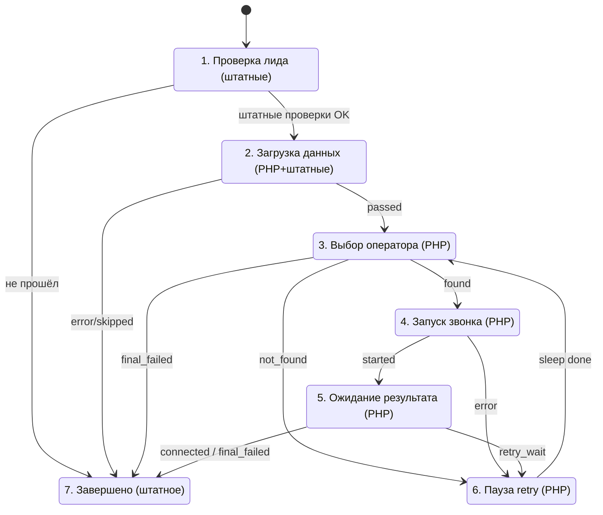

# Lead Callback — автоматический обратный звонок по лиду

## Архитектура

Максимум штатных блоков конструктора БП, PHP только для операций, недоступных штатным блокам. Внешних PHP-файлов нет — каждый блок самодостаточный.

## Файлы модуля

| Файл | Тип | Назначение |
|------|-----|-----------|
| `bp_load_city.txt` | PHP | Чтение города из списка 22 (SIP, пароль, ruleId, timezone, worktime) |
| `bp_load_phone.txt` | PHP | Телефон лида (CCrmFieldMulti + нормализация) + недавние звонки (SQL) |
| `bp_check_worktime.txt` | PHP | Проверка рабочего времени с учётом часового пояса |
| `bp_pick_operator.txt` | PHP | Выбор оператора: список 128 + TimeMan + Vox BUSY + round-robin |
| `bp_start_call.txt` | PHP | Запуск Vox-сценария (curl StartScenarios) |
| `bp_fix_result.txt` | PHP | Фиксация результата: Vox GetCallHistory + SQL + маппинг кодов |
| `bp_sleep.txt` | PHP | Пауза N секунд (sleep) |
| `vox_callback_operator_client.js` | Vox | Voximplant-сценарий: оператор -> клиент |
| `VOX_CALLBACK_SETUP.md` | Doc | Инструкция по настройке Vox-сценария |
| `generate_bpt.py` | Gen | Генератор .bpt файла для импорта БП |
| `lead_callback.bpt` | BPT | Готовый шаблон БП (генерируемый) |

## Штатные блоки конструктора (не PHP)

| Блок | Где используется |
|------|-----------------|
| Условие (IfElse) | Проверка STATUS_ID, SOURCE_ID, UF-полей, переменных БП |
| Изменение документа | Обновление полей лида (STATUS_ID, UF-поля) |
| Изменение переменных | Установка CB_CITY_ID, CB_LEAD_ID, CB_SLEEP_SEC |
| Выполнить мат. операции | Инкремент попытки (+1) |
| Запись в отчёт | Логирование на каждом шаге |
| Установить статус | Переходы между состояниями |

## Схема БП



## Переменные БП

```
CB_LEAD_ID              ID лида (из {=Document:ID})
CB_PHONE                Телефон клиента
CB_CITY_ID              ID города (из {=Document:UF_CRM_1744362815})
CB_SIP_LINE             SIP-линия (из списка 22)
CB_SIP_PASSWORD         Пароль SIP (из списка 22)
CB_RULE_ID              Rule ID Vox (из списка 22)
CB_TIMEZONE             Часовой пояс (из списка 22)
CB_WORKTIME             Рабочее время (из списка 22)
CB_WORKTIME_OK          Y/N — внутри рабочего времени
CB_ATTEMPT              Номер текущей попытки
CB_CITY_RESULT          passed / error
CB_CITY_MESSAGE         Пояснение
CB_PHONE_RESULT         passed / skipped / error
CB_PHONE_MESSAGE        Пояснение

CB_OPERATOR_ID          USER_ID оператора
CB_OPERATOR_NAME        ФИО оператора
CB_OPERATOR_EXTENSION   Внутренний номер
CB_OPERATOR_ELEMENT_ID  ID элемента списка 128
CB_OPERATOR_RESULT      found / not_found / error
CB_OPERATOR_MESSAGE     Пояснение

CB_CALL_ID              ID звонка
CB_VOX_SESSION_ID       Session ID Vox
CB_STARTED_AT           Время запуска звонка
CB_CALL_RESULT          started / error
CB_CALL_MESSAGE         Пояснение

CB_FIX_STATUS           connected / retry_wait / final_failed / error
CB_FIX_RESULT           connected / operator_no_answer / client_no_answer / client_busy
CB_FIX_MESSAGE          Пояснение
CB_FIX_LABEL            Текст статуса для поля лида

CB_SLEEP_SEC            Задержка в секундах
CB_SLEEP_DONE           Y после завершения
```

## Поля лида

| Поле | Код | Назначение |
|------|-----|-----------|
| Статус автодозвона | `UF_CRM_1773155019732` | Текущий статус callback |
| Попыток дозвона | `UF_CRM_1771439155` | Счётчик попыток 1..5 |
| Город+ | `UF_CRM_1744362815` | Город (привязка к списку 22) |
| БП запущен | `UF_CRM_1772538740` | Флаг запуска БП |

## Списки

- **Список 22** (Города): SIP (`PROPERTY_613`), пароль (`SIP_PAROL`), rule_id (`RULE_ID`), часовой пояс (`CHASOVOY_POYAS`), рабочее время (`PROPERTY_400`)
- **Список 128** (Операторы): пользователь (`OPERATOR`), город (`GOROD`), внутренний номер (`VNUTRENNIY_NOMER`), round-robin (`LAST_ASSIGNED_AT`), рабочий день (`WORKDAY_STARTED`), линия свободна (`LINE_FREE`)

## Импорт БП

1. Сгенерировать `.bpt`: `python3 generate_bpt.py`
2. В Битрикс24: CRM -> Настройки -> Бизнес-процессы -> Лиды -> Импорт
3. Загрузить `lead_callback.bpt`
4. Настроить триггер запуска вручную
