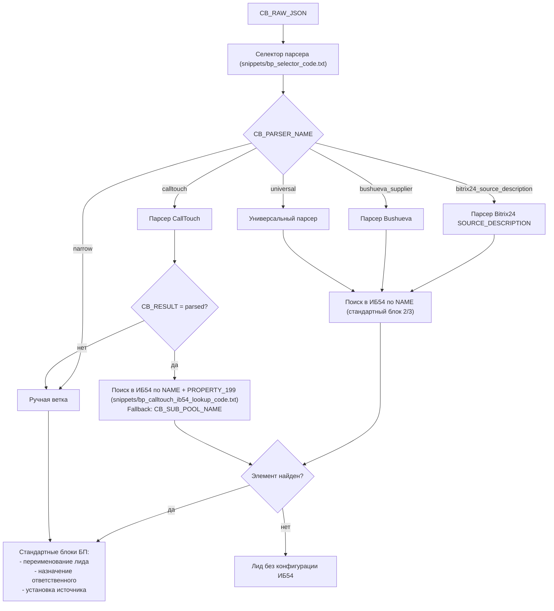

## Общая схема нового обработчика

Этот файл описывает общую логику нового BP-обработчика в `universal-system/v2`.

Важно:
- во все `CodeActivity` вставляется только тело PHP, без `<?php` и `?>`
- селектор выбирает только тип парсера
- сами парсеры только разбирают входные данные и пишут `CB_*`
- дополнительный поиск по ИБ54 нужен только для ветки `calltouch`
- переименование лида остается в стандартных блоках БП

### Общий поток

### Порядок выбора парсера

| Значение `CB_PARSER_NAME` | Условие выбора | Какой блок выполнять |
| --- | --- | --- |
| `bitrix24_source_description` | найден `fields[SOURCE_DESCRIPTION]` | `snippets/bp_bitrix24_source_description_parser_code.txt` |
| `bushueva_supplier` | `ASSIGNED_BY_ID` начинается с `Заявка от Bushueva` | `snippets/bp_bushueva_supplier_parser_code.txt` |
| `calltouch` | найдены технические признаки CallTouch | `snippets/bp_calltouch_parser_code.txt` |
| `universal` | стандартный конверт webhook без узкого совпадения | `snippets/bp_universal_parser_code.txt` |
| `narrow` | не подошел ни один стандартный вариант | ручная или запасная ветка |

### Ветка CallTouch

#### Шаг 1. Парсер

Файл:
- `snippets/bp_calltouch_parser_code.txt`

Что делает:
- распознает CallTouch payload
- повторяет логику `fixCallUrlAndUrl`
- вычисляет основной `nameKey` по приоритету:
  1. `hostname`
  2. домен из `url`
  3. домен из `callUrl`
  4. `siteName`
  5. `subPoolName`
- нормализует телефон
- пишет значения в существующие `CB_*`

Что заполняет:
- `CB_TITLE = calltouch`
- `CB_PHONE`
- `CB_NAME`
- `CB_DOMAIN`
- `CB_SOURCE_DESCRIPTION`
- `CB_COMMENT`
- `CB_RESULT`
- `CB_SITE_ID`
- `CB_SUB_POOL_NAME`

#### Шаг 2. Поиск в ИБ54

Файл:
- `snippets/bp_calltouch_ib54_lookup_code.txt`

Что делает:
- берет `CB_DOMAIN` как основной ключ `NAME`
- берет `CB_SITE_ID` как значение `PROPERTY_199`
- ищет пару `NAME + PROPERTY_199`
- если не найдено, повторяет поиск по `CB_SUB_POOL_NAME + PROPERTY_199`
- подготавливает данные для следующих стандартных блоков БП

Что заполняет:
- `CB_DOMAIN`
- `CB_SOURCE_ID`
- `CB_ASSIGNED_BY_ID`
- `CB_OBSERVER_IDS`
- `CB_CITY_ID`
- `CB_ISPOLNITEL`
- `CB_INFOPOVOD`
- `CB_RESULT`

### Какие переменные обязательно нужны

Если совпадающие по смыслу переменные уже есть в текущем новом обработчике, новые создавать не нужно.

Отдельно для CallTouch нужны только:
- `CB_SITE_ID`
- `CB_SUB_POOL_NAME`

Остальные используются существующие:
- `CB_PHONE`
- `CB_NAME`
- `CB_DOMAIN`
- `CB_SOURCE_DESCRIPTION`
- `CB_COMMENT`
- `CB_RESULT`
- `CB_SOURCE_ID`
- `CB_ASSIGNED_BY_ID`
- `CB_OBSERVER_IDS`
- `CB_CITY_ID`
- `CB_ISPOLNITEL`
- `CB_INFOPOVOD`

### Какие файлы куда вставлять

| Блок БП | Файл |
| --- | --- |
| Селектор | `snippets/bp_selector_code.txt` |
| Парсер CallTouch | `snippets/bp_calltouch_parser_code.txt` |
| Поиск CallTouch в ИБ54 | `snippets/bp_calltouch_ib54_lookup_code.txt` |
| Парсер Bushueva | `snippets/bp_bushueva_supplier_parser_code.txt` |
| Парсер Bitrix24 `SOURCE_DESCRIPTION` | `snippets/bp_bitrix24_source_description_parser_code.txt` |
| Универсальный парсер | `snippets/bp_universal_parser_code.txt` |

### Что происходит после парсинга

После выполнения соответствующего парсера:
- проверяется `CB_RESULT`
- если данные разобраны успешно, дальше идут стандартные блоки БП
- для `calltouch` перед стандартными блоками выполняется lookup в ИБ54
- переименование лида выполняется стандартным блоком, не внутри PHP

### Ожидаемые логи

| Блок | Старт | Успех |
| --- | --- | --- |
| selector | `[bp_selector_code] start` | `[bp_selector_code] parser=... reason=...` |
| calltouch parser | `[bp_calltouch_parser_code] start` | `[bp_calltouch_parser_code] parsed | nameKey=... | siteId=... | phone=...` |
| calltouch lookup | `[bp_calltouch_ib54_lookup_code] start` | `[bp_calltouch_ib54_lookup_code] parsed | foundName=... | siteId=... | elementId=...` |
| bushueva parser | `[bp_bushueva_supplier_parser_code] start` | лог успешного парсинга Bushueva |
| bitrix24 source description parser | `[bp_bitrix24_source_description_parser_code] start` | лог успешного парсинга Bitrix24 |
| universal parser | `[bp_universal_parser_code] start` | лог успешного универсального парсинга |
